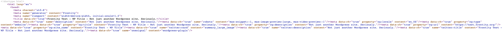
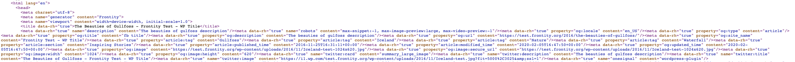

# Demo: Head Tags

[](https://githubbox.com/frontity-demos/frontity-examples/tree/master/head-tags)

This project is a demo to show the use of [`@frontity/head-tags`](https://docs.frontity.org/api-reference-1/frontity-head-tags) package

This package get automatically all the data that the REST API Head Tags plugin exposes in the REST API (depending on the URL) and **adds all the tags in the <head> section of a site to WordPress REST API responses**

This package requires the [REST API Head Tags plugin](https://docs.frontity.org/frontity-plugins/rest-api-head-tags) to be installed in the WP source of data

Once is installed and added to the `frontity.settings.js` there's nothing else to do. Your meta tags will be automatically added to your HTML

If you check the source code At https://head-tags.vercel.app/ you can see how you the package head-tags is automatically adding all the meta tags for that page in the header



This is done for every page → https://head-tags.vercel.app/2016/the-beauties-of-gullfoss/



`@frontity/head-tags` will take care of adding meta tags in the header of your page from both the server side and the client side. You can check this by:

**Server Side**

- Load https://head-tags.vercel.app/ directly in the brower and check meta tags from the source code of that page
- Load https://head-tags.vercel.app/2016/the-beauties-of-gullfoss/ directly in the brower and check meta tags from the source code of that page

**Client Side**

- Load https://head-tags.vercel.app/ directly in the brower and check meta tags from the source code of that page
- Then click in the link "The Beauties of Gullfoss". This will get you to https://head-tags.vercel.app/2016/the-beauties-of-gullfoss/. Check meta tags from the source code of that page


### Install

```
npm install
```

### Run the app

```
npx frontity dev
```

Runs the app in development mode. Open http://localhost:3000 to view it in the browser.
